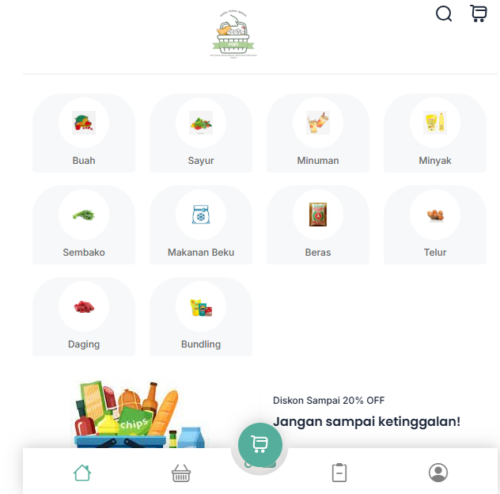

# 🛒 Pokok Pintar — Laravel POS

Aplikasi web Point of Sale sederhana berbasis **Laravel** untuk toko kebutuhan pokok, dengan fitur kategori produk, keranjang belanja, checkout, dan invoice transaksi.

---

## 📸 Screenshot




---

## 📦 Fitur Utama

- 📋 **Manajemen Kategori Produk**  
  Buah, Sayur, Minuman, Minyak, Sembako, Makanan Beku, Beras, Telur, Daging, dan Bundling.

- 🛒 **Keranjang Belanja**  
  Tambah, edit jumlah, dan hapus produk di keranjang.

- 📦 **Checkout & Invoice**  
  Proses pembayaran dan cetak invoice transaksi.

- 🔍 **Search Produk (Coming Soon)**  
  AJAX live search untuk memudahkan pencarian produk.

- 📊 **Dashboard Admin**  
  Kelola produk, kategori, dan laporan transaksi.

---

## 📑 Instalasi

1. **Clone repository:**
   ```bash
   git clone https://github.com/Fadlian17/laravel-pos.git
   cd laravel-pos
